# CI/CD Pipeline — Ahmedrix Educational Ecosystem

## 📋 Document Control

| Version | Date | Author | Description |
|---------|------|--------|-------------|
| 1.0 | 2026 | Ahmed | CI/CD Pipeline — automated quality gates & container delivery |

---

## 📑 Table of Contents

0. [Pipeline at a Glance](#0-pipeline-at-a-glance)
1. [Executive Summary](#1-executive-summary)
2. [Pipeline Architecture](#2-pipeline-architecture)
3. [Workflow Triggers](#3-workflow-triggers)
4. [Stage Breakdown](#4-stage-breakdown)
5. [Security Scanning Layers](#5-security-scanning-layers)
6. [Docker & Container Registry](#6-docker--container-registry)
7. [Composite Actions](#7-composite-actions)
8. [Secrets & Environment Variables](#8-secrets--environment-variables)
9. [Design Decisions](#9-design-decisions)
10. [Getting Started](#10-getting-started)

---

## 0. Pipeline at a Glance

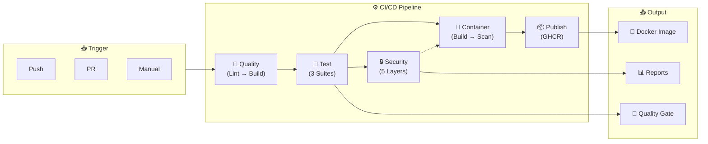

### Quick Stats

| Metric | Value |
|--------|-------|
| **Total Stages** | 5 |
| **Security Layers** | 5 |
| **Parallel Jobs** | 3 (security scans) |
| **Total Runtime** | ~6 minutes |
| **Publish Condition** | Master branch only |
| **Languages** | C# (.NET 9), Docker, YAML |

---

## 1. Executive Summary

The CI/CD pipeline is the automated gatekeeper for every commit, PR, and deployment. It ensures only secure, tested, and high-quality code reaches production.

**What makes it special:**

- **5 security layers** — secrets, dependencies, static analysis, code scanning, container vulnerabilities
- **Parallel execution** — security scans run independently, no waiting
- **Quality gates** — SonarCloud decides if code is merge-ready
- **Container-first** — every commit builds a Docker image; only `master` pushes to GHCR
- **Zero manual intervention** — from commit to container, fully automated

**One developer. One pipeline. Production-grade security.**

---

## 2. Pipeline Architecture

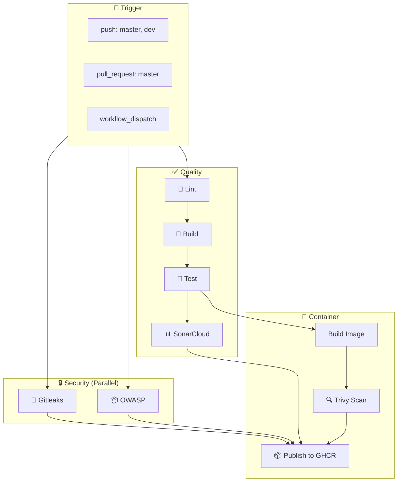

### Dependency Flow

| Stage | Depends On | Runs |
|-------|-----------|------|
| Lint | Nothing | First |
| Build | Lint | After lint |
| Test | Build | After build |
| **Security Scans** | **Parallel** | Immediately |
| Sonar | Build + Test | After both |
| Build Image | Test | After tests |
| Trivy | Build Image | After image |
| Publish | ALL previous gates | Master only |

---

## 3. Workflow Triggers

```yaml
on:
  workflow_dispatch:          # Manual trigger
  push:
    branches: [master, dev]   # Any push to master/dev
  pull_request:
    branches: [master]        # PR targeting master
    types:
      - opened
      - edited
      - review_requested
      - synchronize
      - reopened
```

### Trigger Matrix

| Event | Pipeline Runs | Publishes Image? |
|-------|--------------|------------------|
| Push to `dev` | ✅ Full | ❌ No |
| Push to `master` | ✅ Full | ✅ Yes |
| PR to `master` | ✅ Full |  ✅ Yes |
| Manual (on master) | ✅ Full | ✅ Yes |
| Manual (on dev) | ✅ Full | ❌ No |

---

## 4. Stage Breakdown

### 4.1 Lint — Code Formatting

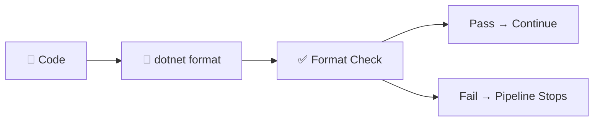

**What it does:**
- Runs `dotnet format` on the solution
- Ensures consistent code style across all files
- `neutral_check_on_warning: true` — warnings don't fail the build
- Only **errors** stop the pipeline

**Why first:** If code is ugly, fix it before wasting CPU on builds.

---

### 4.2 Build — Compilation

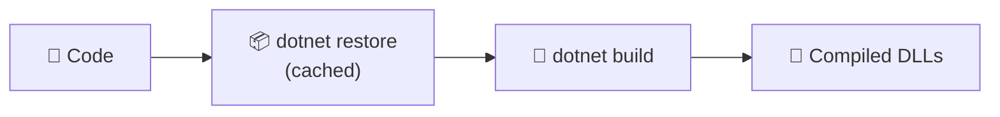

**What it does:**
- Restores NuGet packages (with caching — 90s → 10s)
- Builds the application
- Fails if compilation fails

**Why:** Fail fast. If it doesn't compile, nothing else matters.

---

### 4.3 Test — Unit & Integration

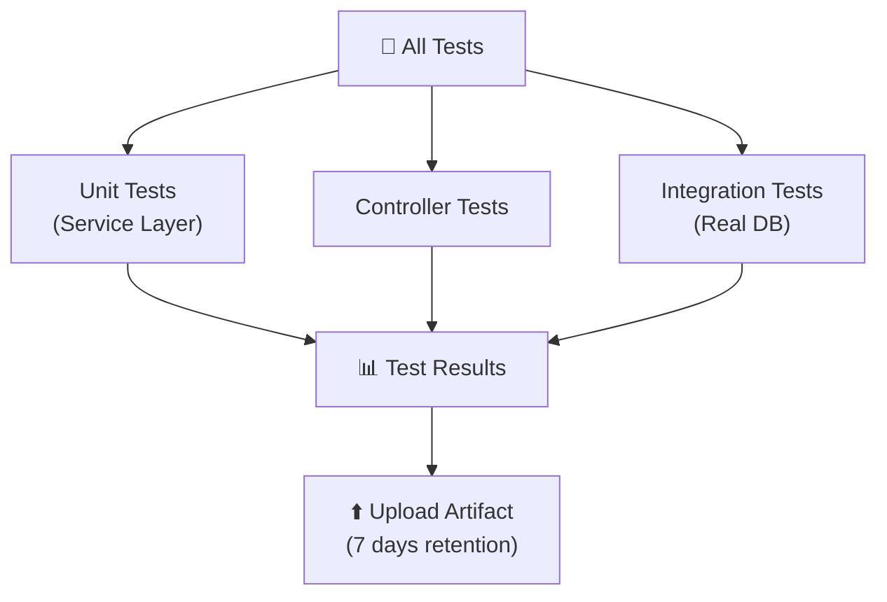

**Three test suites:**

| Test Suite | Purpose | What It Tests |
|------------|---------|---------------|
| **Service Tests** | Business logic | Validators, services, calculations |
| **Controller Tests** | API endpoints | HTTP responses, routing, auth |
| **Integration Tests** | Database + EF Core | Queries, migrations, real DB |

**Why separate:** Clear separation of concerns. I know exactly which layer failed.

---

### 4.4 SonarCloud — Quality Gate

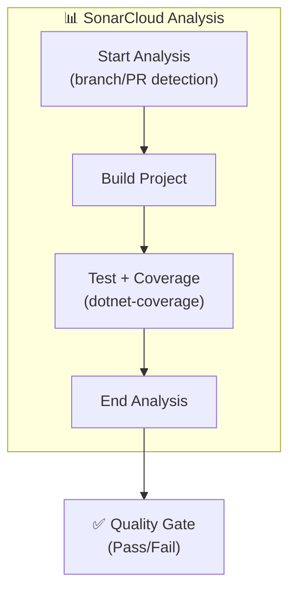

**What it does:**
- Static code analysis (bugs, vulnerabilities, code smells)
- Test coverage measurement
- PR decoration (inline comments on problematic code)
- Fails PR if quality gate criteria aren't met

**PR Detection:** If event is `pull_request`, uses PR params. Otherwise uses branch name.

**Why SonarCloud:** Free for open source, integrates with GitHub PRs, enforces quality automatically.

---

### 4.5 Security Scans (Parallel)

These run **in parallel** with build/test stages — no waiting.

#### 4.5.1 Secret Scan — Gitleaks

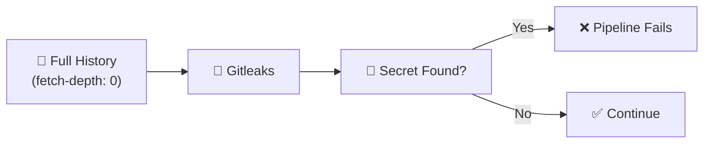

**Scans for:**
- API keys, tokens, passwords
- Connection strings
- Private keys
- Hardcoded credentials

**Why `fetch-depth: 0`:** Without full history, Gitleaks can't detect secrets in older commits. It scans the entire repository, not just the latest changes.

---

#### 4.5.2 Dependency Scan — OWASP

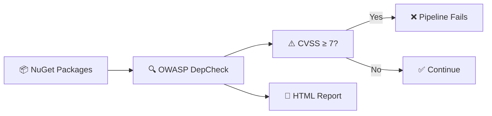

**Scans:**
- `packages.lock.json` and `.csproj` files
- Known CVEs (Common Vulnerabilities)
- **Fails build** if CVSS score ≥ 7
- Uploads HTML report for manual review

**Why CVSS 7:** Critical and High vulnerabilities are unacceptable. Medium/Low are warnings only.

---

### 4.6 Docker — Build & Scan

#### 4.6.1 Build Image

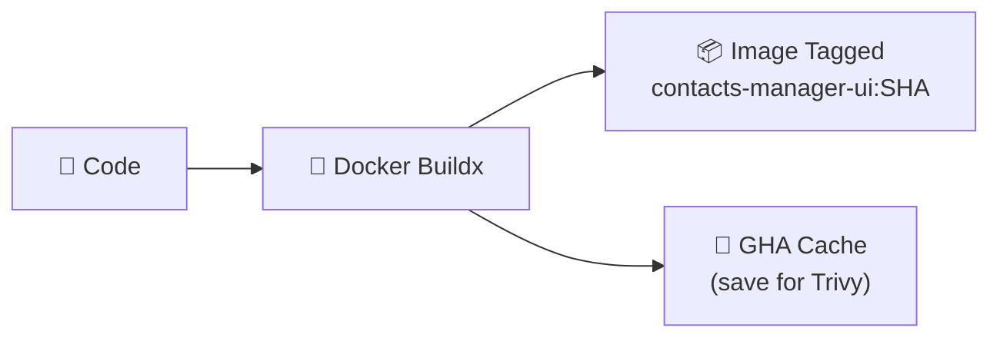

**What it does:**
- Builds Docker image using `ContactsManager.UI/Dockerfile`
- Tags with commit SHA: `contacts-manager-ui:abc123`
- Saves layers to GHA cache (buildx `cache-to`)
- **Does NOT push** to registry (validation only)

**Why SHA tagging:** Every commit gets a unique image. Trivy scans the same image that will eventually be published.

---

#### 4.6.2 Trivy Container Scan

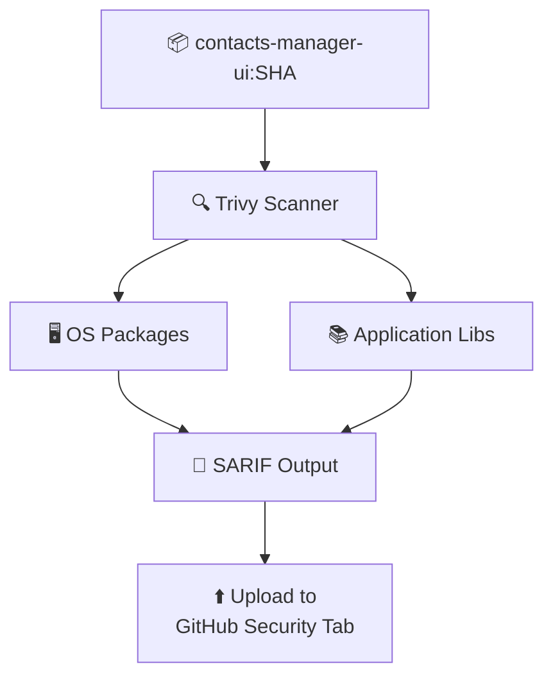

**What it does:**
- Scans Docker image for vulnerabilities
- Checks OS packages + app libraries
- Ignores unfixed vulnerabilities (`ignore-unfixed: true`)
- Outputs SARIF format for GitHub integration
- **Uploads results to Security tab** — visible in the repo

**Why `ignore-unfixed: true`:** Some vulnerabilities have no patch yet. Blocking on them would stop all deployments. Track them separately.

---

### 4.7 Publish — GHCR (Master Only)

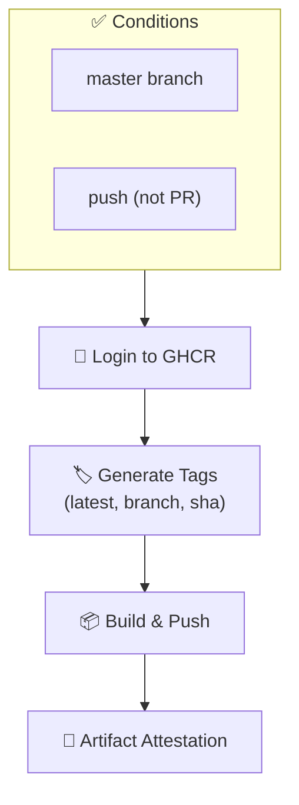

**Tags Generated:**

| Tag | Purpose |
|-----|---------|
| `latest` | Most recent master build |
| `master` | Branch reference |
| `sha-<hash>` | Immutable version (rollback safety) |

**Build-args injected:**
```yaml
ConnectionStrings__ContactDb: ${{ secrets.DB_CONNECTION_STRING }}
Serilog__WriteTo__2__Args__connectionString: ${{ secrets.SERILOG_DB_CONNECTION }}
```

These become environment variables in the container at runtime.

**Why master only:** Dev builds aren't production-ready. Master is the source of truth.

---

## 5. Security Scanning Layers

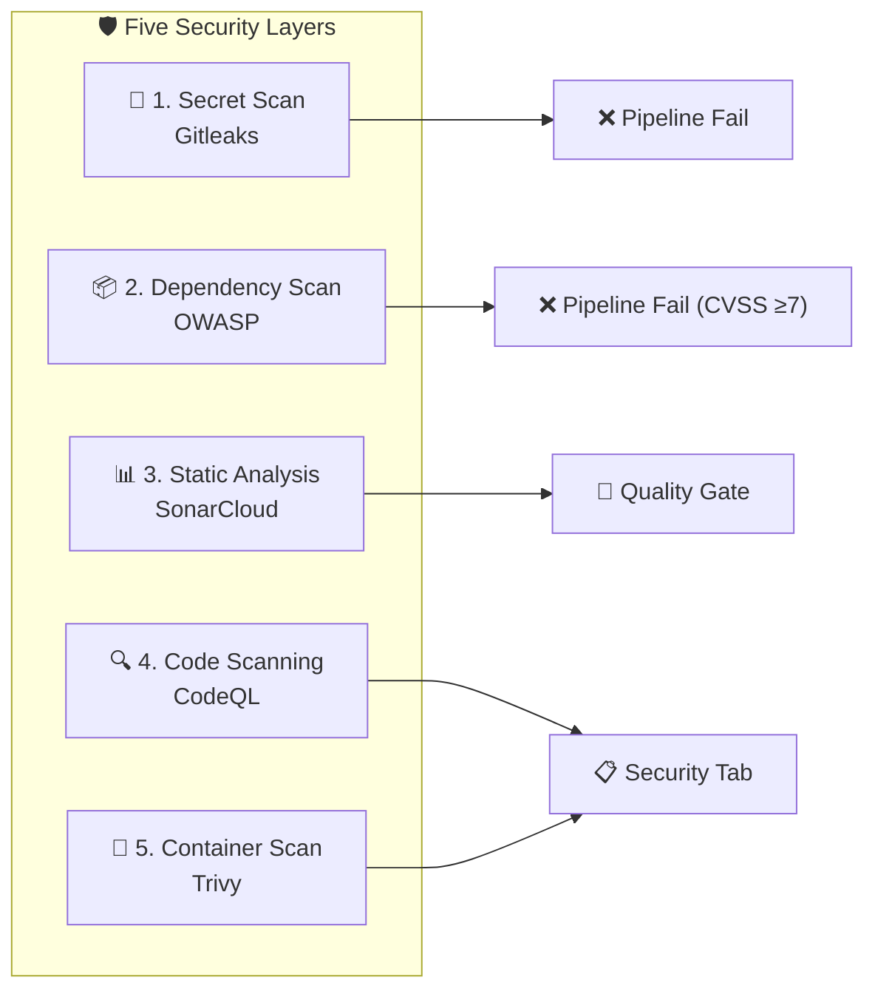

| Layer | Tool | When | Outcome |
|-------|------|------|---------|
| 1. Secrets | Gitleaks | Every run | Pipeline fail |
| 2. Dependencies | OWASP | Every run | Pipeline fail (CVSS ≥ 7) |
| 3. Static Analysis | SonarCloud | Every run | Quality gate (PR block) |
| 4. Code Scanning | CodeQL | Every run | Security tab (monitoring) |
| 5. Container | Trivy | After build | Security tab (monitoring) |

**Why five layers:** No single tool catches everything. Defense in depth = production confidence.

---

## 6. Docker & Container Registry

### 6.1 Dockerfile — Multi-Stage Build

```dockerfile
# ========== STAGE 1: Base (Runtime) ==========
FROM mcr.microsoft.com/dotnet/aspnet:9.0 AS base
USER $APP_UID
WORKDIR /app
EXPOSE 8080

# ========== STAGE 2: Build (SDK) ==========
FROM mcr.microsoft.com/dotnet/sdk:9.0 AS build
ARG BUILD_CONFIGURATION=Release
WORKDIR /src

# Copy project files and restore (layer caching)
COPY ["ContactsManager.UI/ContactsManager.UI.csproj", "ContactsManager.UI/"]
COPY ["ContactsManager.Inferastructure/ContactsManager.Inferastructure.csproj", "ContactsManager.Inferastructure/"]
COPY ["ContactsManger.Core/ContactsManger.Core.csproj", "ContactsManger.Core/"]
RUN dotnet restore "./ContactsManager.UI/ContactsManager.UI.csproj"

# Copy everything and build
COPY . .
WORKDIR "/src/ContactsManager.UI"
RUN dotnet build "./ContactsManager.UI.csproj" -c $BUILD_CONFIGURATION -o /app/build

# ========== STAGE 3: Publish ==========
FROM build AS publish
ARG BUILD_CONFIGURATION=Release
RUN dotnet publish "./ContactsManager.UI.csproj" -c $BUILD_CONFIGURATION -o /app/publish /p:UseAppHost=false

# ========== STAGE 4: Final (Runtime) ==========
FROM base AS final
WORKDIR /app
COPY --from=publish /app/publish .
ENTRYPOINT ["dotnet", "ContactsManager.UI.dll"]
```

### 6.2 Build Stages Explained

| Stage | Purpose | What Happens |
|-------|---------|--------------|
| **base** | Runtime environment | Sets user, workdir, exposes port |
| **build** | Compilation | Restores packages, builds code |
| **publish** | Artifact generation | Publishes to `/app/publish` |
| **final** | Production image | Copies published files, sets entrypoint |

### 6.3 Docker Optimization — Layer Caching

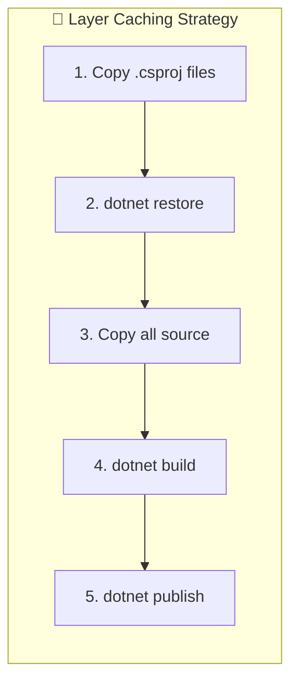

**Why this matters:**
- `.csproj` files change rarely → restore layer stays cached
- Copy source happens AFTER restore → source changes don't invalidate cache
- **Build time:** 5 minutes → 30 seconds (with cache)

### 6.4 GHA Cache Strategy

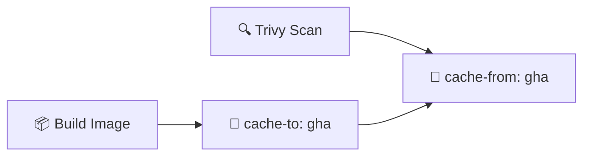

**Why this matters:** Without caching, Trivy rebuilds the entire image (5-10 minutes wasted). With caching, it loads existing layers and scans.

### 6.5 GHCR Publishing

| Step | What Happens |
|------|--------------|
| 1 | Login to GHCR with `GITHUB_TOKEN` |
| 2 | Generate tags (sha, branch, latest) |
| 3 | Build + Push with build-args (secrets) |
| 4 | Generate artifact attestation (provenance) |

---

## 7. Composite Actions

To keep the pipeline DRY (Don't Repeat Yourself), I extracted reusable actions:

| Action | Purpose | Used In |
|--------|---------|---------|
| `CacheDependencies` | Setup .NET SDK + restore with caching | lint, build, test, sonar |
| `SecretScan` | Gitleaks full-history secret scan | secret_scan job |
| `OWASP_Dependency_Check` | CVE scanning of NuGet packages | security_scan job |
| `SonarCloud/SonarScane` | Static analysis + coverage upload | sonar job |
| `Trivy_Container_Scan` | Image scan → SARIF upload | trivy_container_scan job |

### 7.1 CacheDependencies — The Performance Hero

```yaml
name: 'Setup .NET and Restore Dependencies'
runs:
  using: 'composite'
  steps:
    - name: Setup .NET
      uses: actions/setup-dotnet@v4
      with:
        global-json-file: ContactsManager.UI/global.json
        cache: true
        cache-dependency-path: '**/packages.lock.json'
    - name: Restore dependencies
      run: dotnet restore --locked-mode
      working-directory: ContactsManager.UI
```

**What this achieves:**

| Metric | Before | After |
|--------|--------|-------|
| Restore time | 90 seconds | 10 seconds |
| Cache hit rate | 0% | ~90% |
| Pipeline runtime | 12 minutes | 6 minutes |

### 7.2 SonarCloud Composite Action

```yaml
name: 'SonarCloud .NET Scan'
inputs:
  sonar_token: { required: true }
  project_key: { required: true }
  organization: { required: true }
runs:
  using: 'composite'
  steps:
    - name: Setup Java
      uses: actions/setup-java@v4
      with: { distribution: 'zulu', java-version: '17' }
    
    - name: Cache SonarCloud packages
      uses: actions/cache@v4
      with:
        path: ~/.sonar/cache
        key: ${{ runner.os }}-sonar-${{ hashFiles('**/*.csproj') }}
    
    - name: Install SonarScanner
      run: dotnet tool install --global dotnet-sonarscanner
    
    - name: Sonar Begin
      run: |
        if [ "${{ github.event_name }}" = "pull_request" ]; then
          dotnet sonarscanner begin /k:"${{ inputs.project_key }}" ...
        else
          dotnet sonarscanner begin /k:"${{ inputs.project_key }}" /d:sonar.branch.name="${{ github.ref_name }}"
        fi
    
    - name: Build Project
      run: dotnet build ContactsManager.UI --no-restore
    
    - name: Run Tests with Coverage
      run: dotnet-coverage collect 'dotnet test ContactsManager.UI --no-restore' -f xml -o 'coverage.xml'
    
    - name: Sonar End
      run: dotnet sonarscanner end /d:sonar.token="${{ inputs.sonar_token }}"
```

---

## 8. Secrets & Environment Variables

### 8.1 Required Repository Secrets

| Secret | Purpose | Used By |
|--------|---------|---------|
| `DB_CONNECTION_STRING` | Database connection (SQL Server) | Build, Tests, Container |
| `SERILOG_DB_CONNECTION` | Serilog logging DB | Build, Container |
| `SONAR_TOKEN` | SonarCloud authentication | Sonar job |
| `SONAR_PROJECT_KEY` | SonarCloud project identifier | Sonar job |
| `SONAR_ORGANIZATION` | SonarCloud organization | Sonar job |
| `GITHUB_TOKEN` | Provided automatically | Gitleaks, GHCR push |

### 8.2 Environment Variables

```yaml
env:
  REGISTRY: ghcr.io
  IMAGE_NAME: ${{ github.repository }}
  NUGET_PACKAGES: ${{ github.workspace }}/.nuget/packages
```

### 8.3 Secrets Security

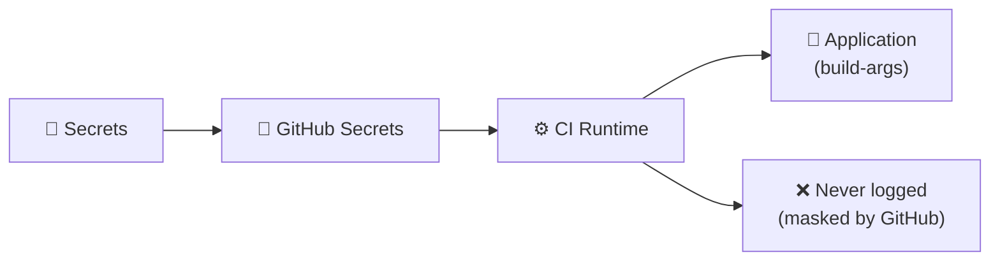

**Golden rule:** Secrets are **never** hardcoded, logged, or visible in artifacts.

---

## 9. Design Decisions

### Decision 1: SHA Pinning for Third-Party Actions

**The problem:** Using version tags like `@v4` can break unexpectedly.

**My solution:** Pin every third-party action to a specific SHA hash.

```yaml
# ✅ Good — immutable
uses: docker/setup-buildx-action@c887d9748da14dcb42b11cf8bcc773b301ea55b5

# ❌ Bad — may break
uses: docker/setup-buildx-action@v4
```

**Why:** Reproducible builds. SonarCloud and security compliance require it.

---

### Decision 2: Parallel Security Scans

**The problem:** Sequential security scans = slow pipeline (15+ minutes).

**My solution:** Run all security scans in parallel with build/test.

**Why:** Pipeline stays fast (~6 minutes) while catching every issue.

```yaml
lint ──┬── build ── test ──┬── sonar
       │                   ├── build-image ── trivy
       ├── secret_scan     └── ...
       └── security_scan   # These run immediately, no waiting
```

---

### Decision 3: Master-Only Publishing

**The problem:** Every push to `dev` builds an image. Do we publish all?

**My solution:** Build every commit (validation), publish ONLY `master` pushes.

**Why:**
- Dev images would clutter GHCR
- Only `master` is production-ready
- PR images are tested but never stored

---

### Decision 4: Quality Gate Before Publish

**The problem:** A buggy image could reach production.

**My solution:** `publish-image` waits for ALL quality gates:

- ✅ SonarCloud (quality gate)
- ✅ Trivy (no critical vulnerabilities)
- ✅ Gitleaks (no secrets)
- ✅ OWASP (no CVSS ≥ 7)

**Why:** If any check fails, the image doesn't get published. No shortcuts.

---

### Decision 5: `fetch-depth: 0` for Security Tools

**The problem:** Default checkout is only the latest commit (`fetch-depth: 1`).

**My solution:** Use `fetch-depth: 0` for Gitleaks and SonarCloud.

**Why:**
- Gitleaks needs full history to detect secrets in old commits
- SonarCloud needs full history for accurate blame/issue tracking

---

### Decision 6: Separate CodeQL Workflow

**The problem:** CodeQL analysis is slow (10-15 minutes).

**My solution:** Separate workflow (`codeql.yml`) that runs on PRs and pushes.

**Why:**
- CI pipeline stays fast (~6 minutes)
- CodeQL failures don't block PRs (monitoring only)
- Results still appear in Security tab

---

## 10. Getting Started

### 10.1 Prerequisites

1. GitHub repository with secrets configured
2. SonarCloud account (free for open source)
3. GHCR access (free with GitHub)

### 10.2 Setting Up Secrets

Go to `Settings → Secrets and variables → Actions` and add:

| Secret | Value | Where to Get |
|--------|-------|--------------|
| `DB_CONNECTION_STRING` | SQL Server connection string | Your database |
| `SERILOG_DB_CONNECTION` | Serilog DB connection | Your logging DB |
| `SONAR_TOKEN` | SonarCloud auth token | SonarCloud → My Account → Security |
| `SONAR_PROJECT_KEY` | Project identifier | SonarCloud project dashboard |
| `SONAR_ORGANIZATION` | Organization slug | SonarCloud org settings |

### 10.3 Running the Pipeline

```bash
# Push to dev — full pipeline (no publish)
git push origin dev

# Push to master — full pipeline + publish
git checkout master
git push origin master

# Open PR to master — validation only (no publish)
# (Create PR through GitHub UI)

# Manual trigger
# GitHub → Actions → CI → Run workflow
```

### 10.4 Local Testing

```bash
# Lint
dotnet format ContactsManager.UI

# Build
dotnet build ContactsManager.UI

# Run tests
dotnet test Tests/ContactsManger.ServiceTests.csproj
dotnet test ContactsManager.ControllersTest/ContactsManager.ControllersTest.csproj
dotnet test ContactsManager.IntegrationTests/ContactsManager.IntegrationTests.csproj

# Build Docker locally
docker build -f ContactsManager.UI/Dockerfile -t local:test .

# Run container
docker run -p 8080:8080 local:test
```

---

## 🏁 Summary

| Aspect | Implementation |
|--------|----------------|
| **Pipeline** | GitHub Actions |
| **Language** | .NET 9 (C#) |
| **Container Registry** | GHCR |
| **Code Quality** | SonarCloud |
| **Security** | 5-layer (Gitleaks, OWASP, Sonar, CodeQL, Trivy) |
| **Trigger** | Push (dev/master), PR, Manual |
| **Publish** | Master only |
| **Runtime** | ~6 minutes |

---

**— Ahmed, Solo Architect & Developer**

*One pipeline. One developer. Production-grade confidence.*

---

## ❓ FAQ

**Q: Why does `publish-image` wait for ALL gates?**  
A: No shortcuts. If any check fails, the image doesn't get published.

**Q: Why does Sonar need build + test?**  
A: Needs compiled code + coverage data to analyze.

**Q: Why separate CodeQL?**  
A: CodeQL adds 10-15 minutes. I want the CI pipeline fast (~6 min). CodeQL runs separately for monitoring.

**Q: What if a scan fails?**  
A: Pipeline fails. PR blocked. Fix it before merging.

**Q: How do I rollback a bad deployment?**  
A: GHCR has immutable SHA tags. Deploy the previous SHA tag.

**Q: Why 5 security layers?**  
A: Defense in depth. No single tool catches everything.
---


*Built from scratch. Secured by design. Deployed with confidence.*
